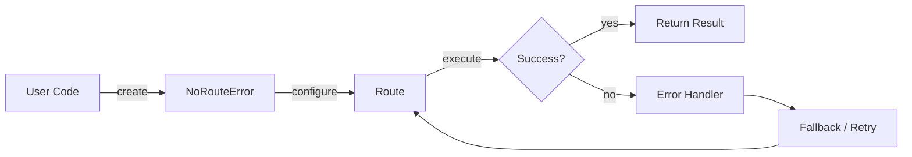
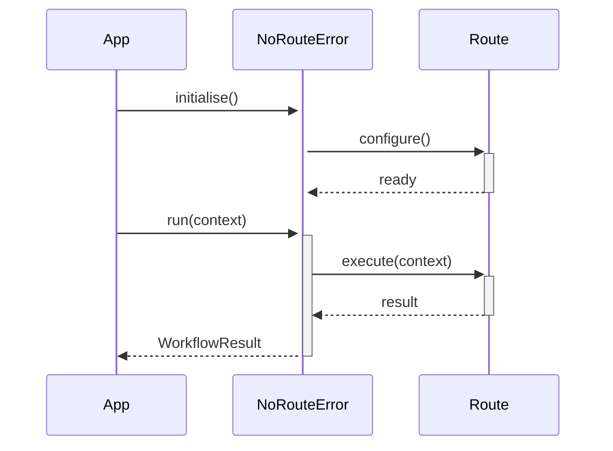

<div align="center">

</div>

# agent-router

**Production request routing for multi-agent systems**

[](https://pypi.org/project/agent-router/) [](https://python.org) [](LICENSE) [](#)

---

## The Problem

Without intent routing, every incoming message hits a single monolithic handler that pattern-matches with fragile if-chains. New intents break existing logic; high-priority tasks queue behind low-priority ones. Routing is the first thing that fails at scale.

## Installation

```bash
pip install agent-router
```

## Quick Start

```python
from agent_router import NoRouteError, Route, RegexRoute

# Initialise
instance = NoRouteError(name="my_agent")

# Use
# see API reference below
print(result)
```

## API Reference

### `NoRouteError`

```python
class NoRouteError(Exception):
    """Raised when no route matches a request and no fallback is set."""
    def __init__(self, request: str) -> None:
```

### `Route`

```python
class Route:
    """A routing rule that matches a request string against a pattern."""
    def __init__(
    def pattern(self) -> str:
    def matches(self, request: str) -> bool:
        """Return True if the pattern appears as a substring of the request."""
    def __call__(self, request: str) -> Any:
```

### `RegexRoute`

```python
class RegexRoute(Route):
    """A route that matches using a regular expression.
    def __init__(
    def matches(self, request: str) -> bool:
    def __call__(self, request: str) -> Any:
```

### `KeywordRoute`

```python
class KeywordRoute(Route):
    """A route that matches if ANY of the given keywords is present in the request."""
    def __init__(
```


## How It Works

### Flow



### Sequence



## Philosophy

> The *Chakravyuha* had seven rings — routing is knowing which ring each warrior belongs in.

---

*Part of the [arsenal](https://github.com/darshjme/arsenal) — production stack for LLM agents.*

*Built by [Darshankumar Joshi](https://github.com/darshjme), Gujarat, India.*
